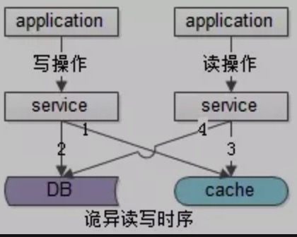

## 缓存和数据一致性问题

缓存的设置，对于读请求：
   * 先取缓存，在取DB
   * 如果cache 命中，直接返回
   * 如果cache 未命中，从数据库读取，在set cache.

写操作（既要操作数据，又要操作缓存）设置缓存：
   *  先删除缓存，在操作数据。
如果是先操作数据库，数据库写成功了，删除缓存没有成功，会造成业务上的不可接受。而先删除缓存，如果数据库未成功，只是多了一次设置缓存的操作。
   *  怎么保证缓存和数据库的双写一致性。
     -  数据库有主从延迟的情况，既是此时数据已经写入成功，缓存也删除成功，但是数据库主从同步未完成，在主从同步的间隙有请求进来，这个是解决方案是订阅数据binglog日志，订阅工具是DTS，可以是cannal，也可以自己订阅和分析binlog。从库执行完写操作，向缓存再次发起删除，淘汰这段时间内可能写入缓存的旧数据。这样也只是有很短的一段时间内是旧数据。或者标记此次数据读取在主从同步时间内从主库读取。
     -  并发请求的时序问题，既有读请求，也有写请求。这个时候由于服务器是多台，与MySQL的链接是多个，因此无法保持时序性。
       如图
       
       在分布式环境下，数据的读写都是并发的，上游有多个应用，通过一个服务的多个部署（为了保证可用性，一定是部署多份的），对同一个数据进行读写，在数据库层面并发的读写并不能保证完成顺序，也就是说后发出的读请求很可能先完成（读出脏数据）：
       
          - （a）发生了写请求A，A的第一步淘汰了cache（如上图中的1）
          - b）A的第二步写数据库，发出修改请求（如上图中的2）
          - （c）发生了读请求B，B的第一步读取cache，发现cache中是空的（如上图中的步骤3）
          - （d）B的第二步读取数据库，发出读取请求，此时A的第二步写数据还没完成，读出了一个脏数据放入cache（如上图中的步骤4）
       
           即在数据库层面，后发出的请求4比先发出的请求2先完成了，读出了脏数据，脏数据又入了缓存，缓存与数据库中的数据不一致出现了
       
       能否做到先发出的请求一定先执行完成呢？常见的思路是“串行化”。如果我们把对于某一个数据的操作落盘到同一个服务器，同一个数据库链接上即可解决这个问题。服务器上需要在网关层做hash处理，数据库方面需要在服务器的连接池上做hash处理。

参考资料;

[缓存与数据库一致性保证](https://mp.weixin.qq.com/s/z364m8iWgk2tSag_q7VUiQ) 

[究竟先操作缓存还是数据库](https://mp.weixin.qq.com/s/CuwTRC8HrMHxWZe3_OX98g)

